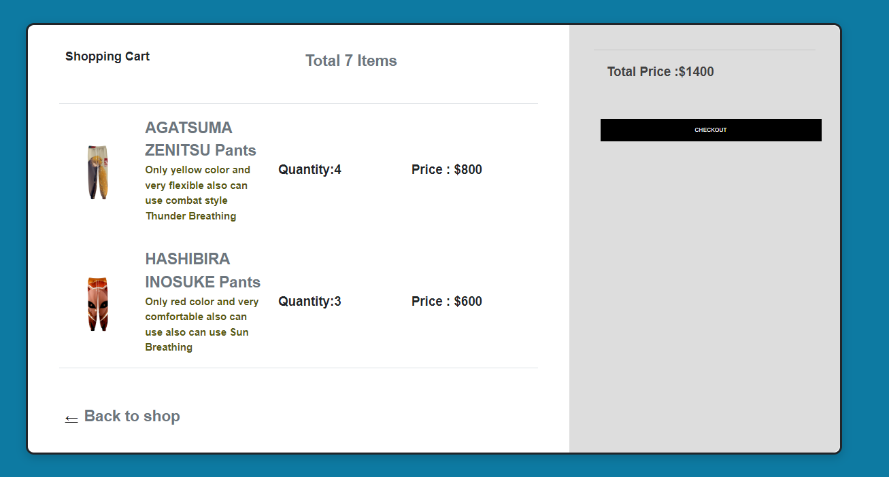

# Anime Online Shop
* Developed an anime store for Kimetsu no Yaiba.
* Integrated a RESTful API to retrieve product data from a backend server built with Node.js and Express.js.
* Implemented secure user authentication and authorization for seamless login and checkout processes.
* Technologies Used: HTML, CSS, JavaScript, TypeScript, Node.js, Express.js, RESTful API, PostgreSQL.
# Screenshots
|                        |               |
| -------------------------------------------------------- | ------------------------------------------------------- |
| **Home Page**                                            | **Products Page**                                       |
|           |                       |
| **Single Product Page**                                  | **Cart Page**                                           |

# ERD
 
# Setup
To run locally, first install node_modules
```
cd mainpj
npm install
```
Create postgresSQL database and account
```
create database "database name";
create role "username" with password 'password' superuser;
alter role "username" with login;
```
Then create a .env file in the mainpj with .env.example. You may change database user/password/secert as you may wish.
# Run app
Start both client and server concurrently from the root directory.
```
cd mainpj
npm run dev
```
Go to http://localhost:8080 to view the app running on your browser.